# KEST2VW-lokaverkefni

# JOURNAL

These past few days I’ve been working through steps 2, 3, and 4 of the KEST2VW final project, and honestly, it’s been a mix of confusion, trial-and-error, and small victories. I started by getting my Windows 11 virtual machine ready. I installed Python, Git, and VS Code since those were required, and made sure everything was working before moving on. Once the basics were set up, I began working on the user management part, which ended up taking way longer than I expected.

The assignment required setting up nine users for a fictional company, each with their own department group, plus an “Allir” group that everyone belongs to. Instead of creating users one by one, I made a CSV file with all their info: full name, first name, last name, username, and department. Then I wrote a PowerShell script that imported that CSV and automatically created each account. I set the password for all users to “1234kest” at first, then made sure that the password had to be changed on the first login. I learned how to do this using a YouTube tutorial about PowerShell user creation, since the built-in documentation was a little confusing. After running the script, I used commands like Get-LocalUser and Get-LocalGroupMember to double-check everything. It actually felt pretty satisfying seeing all the users show up correctly.

Next came the folders and permissions. I created a folder called “Gögn” on the C: drive, and inside it I made folders for each group: Sala, Innkaup, Yfirstjórn, plus a shared folder called Sameign. For each folder, I set NTFS permissions so only members of the matching group had access. Sameign was open to everyone. I also added a text file inside each folder named after the group. This part wasn’t too hard, but I had to redo it once because I accidentally applied permissions to the wrong user.

After that, I moved on to the security settings. I opened the Local Security Policy tool and changed the password rules so the minimum length was 8 characters and password complexity was required. I tested this by trying to change a user's password to something weak just to see if Windows blocked it, and it did. Then I configured the firewall. I set it so all incoming network traffic was blocked except ICMP (ping), because the assignment said ping should still work. Once I applied the rule, I tested it with ping to make sure the machine still responded.

By the end of all this, I had steps 2 through 4 fully done. It took time, and I ran into a bunch of small issues, but everything works now and I feel a lot more confident with PowerShell, user management, and Windows permissions than when I started.

## *Here are the pictures that show my windows project* 

#### This image shows that the groups have been created.
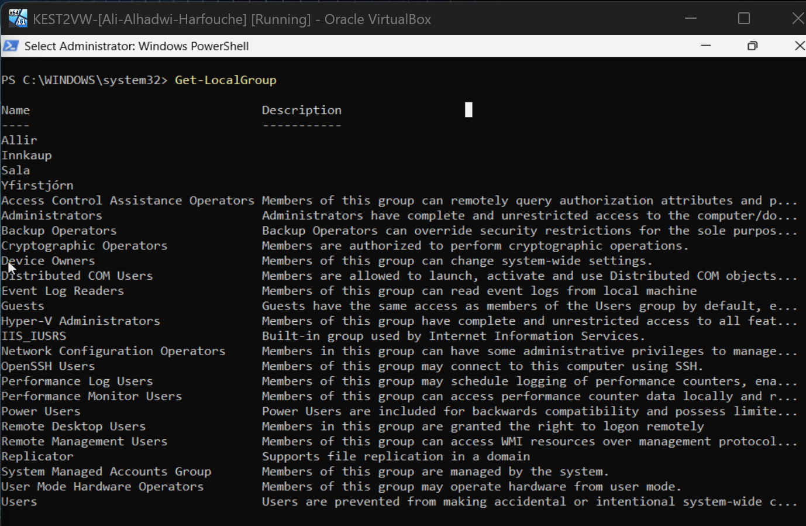
#### This image is to show that (GÖGN) have been created and its content.
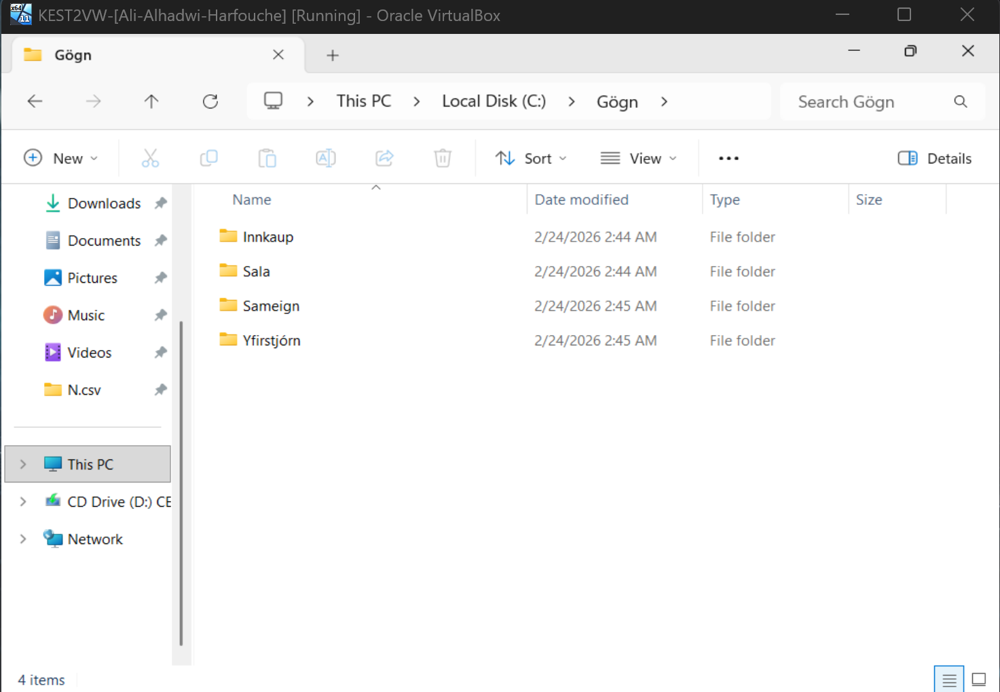
#### This image shows that (GÖGN) has the right content in it.
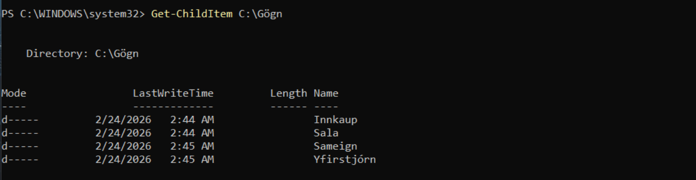
#### The next 4 images shows the (txt.file) that is with in the files in (GÖGN).

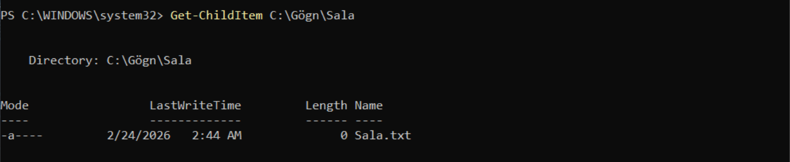
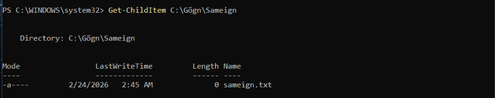
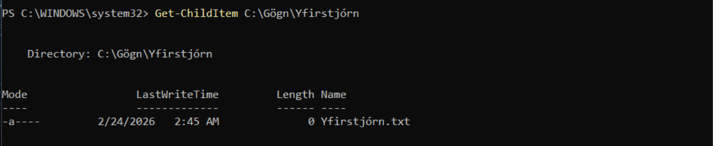
### This here shows the groups and the users that belongs to that group.
#### Users in (Innkaup) group.
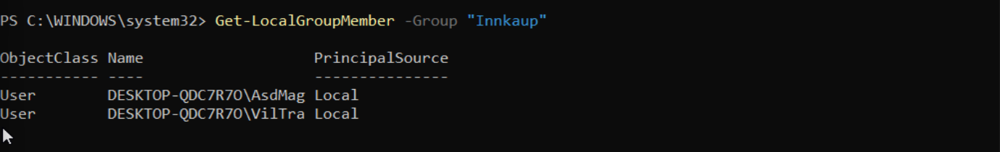
#### Users in (Sala) group.
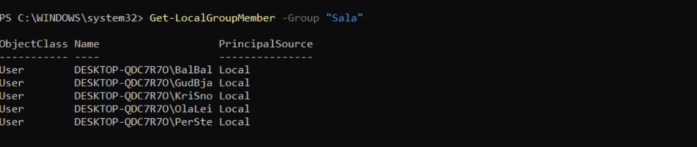
#### Users in (Yfirstjorn) group.
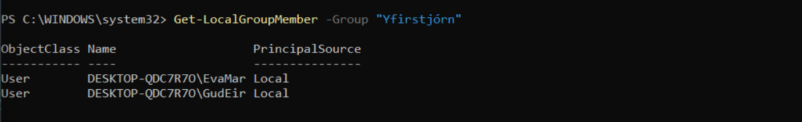
#### This picture here shows that all the users are in the (Allir) group.
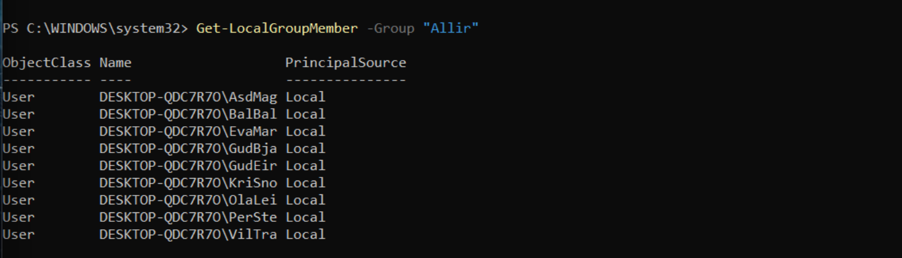
#### This picture proofs that the users are active currntly.
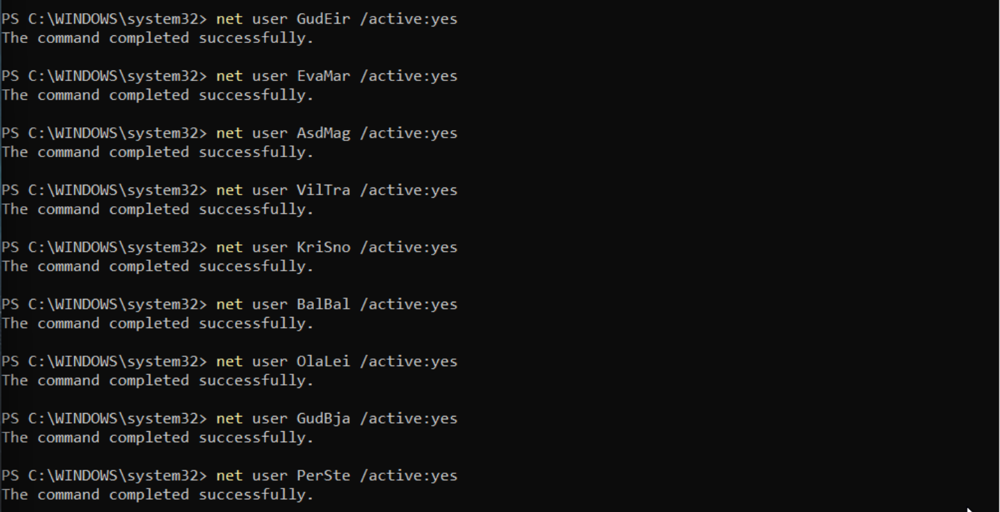
#### This is a seconed proof are users are active.
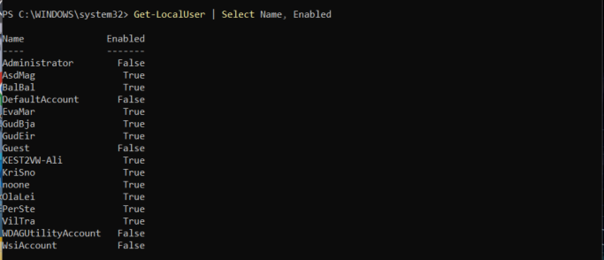
### Now in the next 9 pictures you will see information that includes everything you need to know about the users one by one.
#### This is for the user (GudEir).
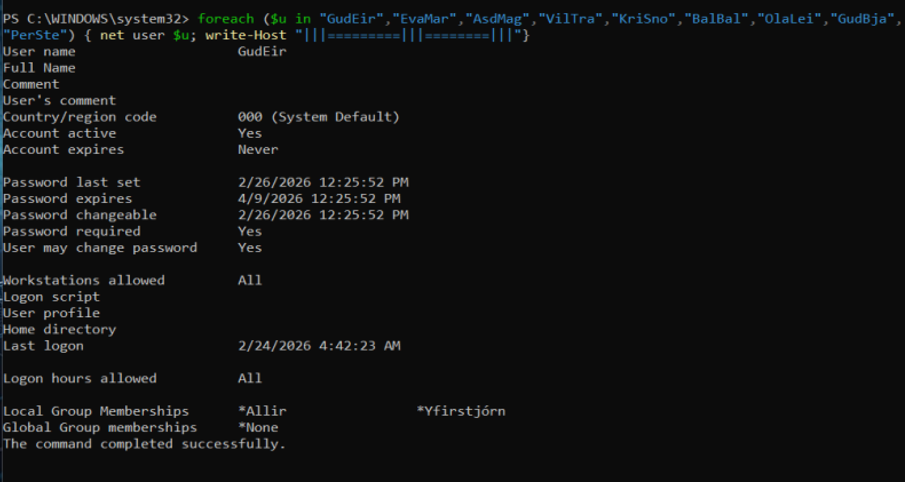
#### This is for the user (AsdMag).
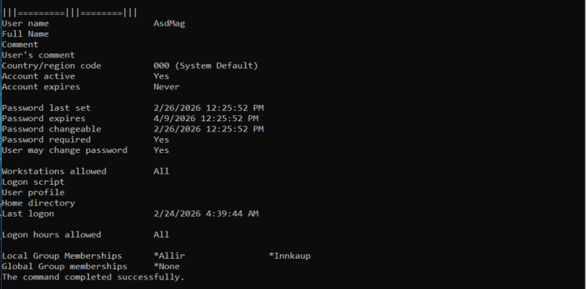
#### This is for the user (BalBal).
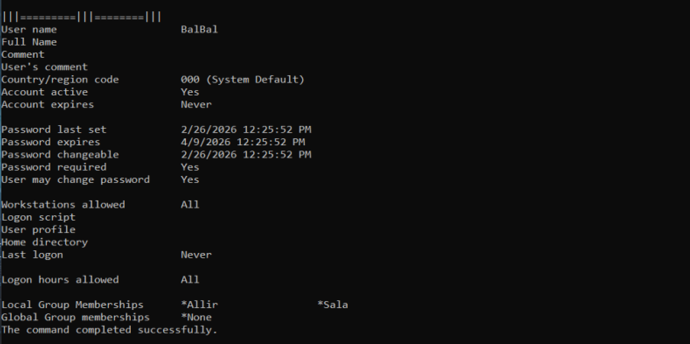
#### This is for the user (EvaMar).
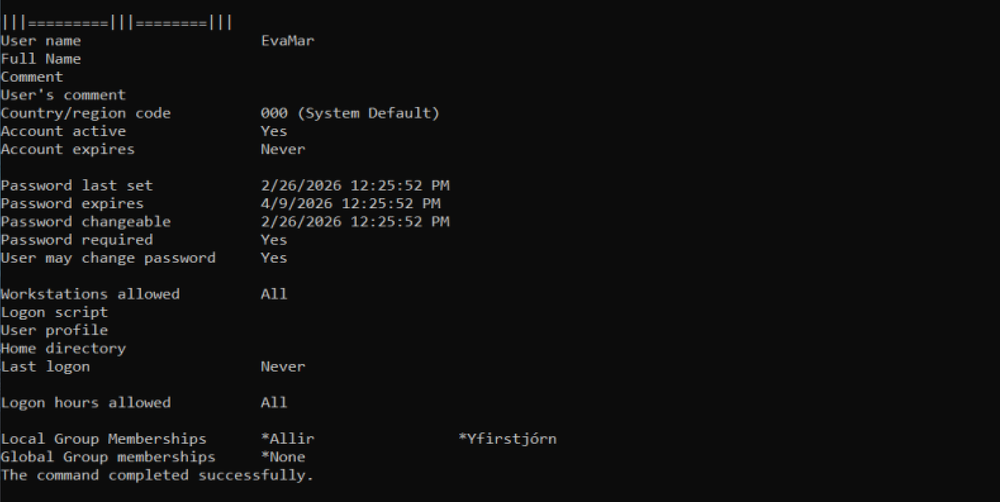
#### This is for the user (GudBja).
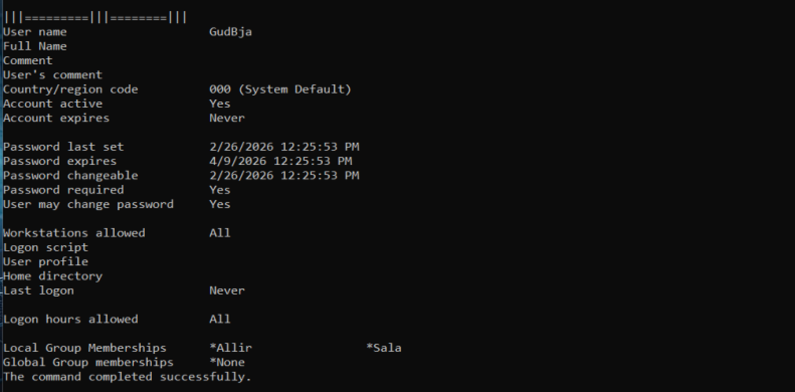
#### This is for the user (KriSno).
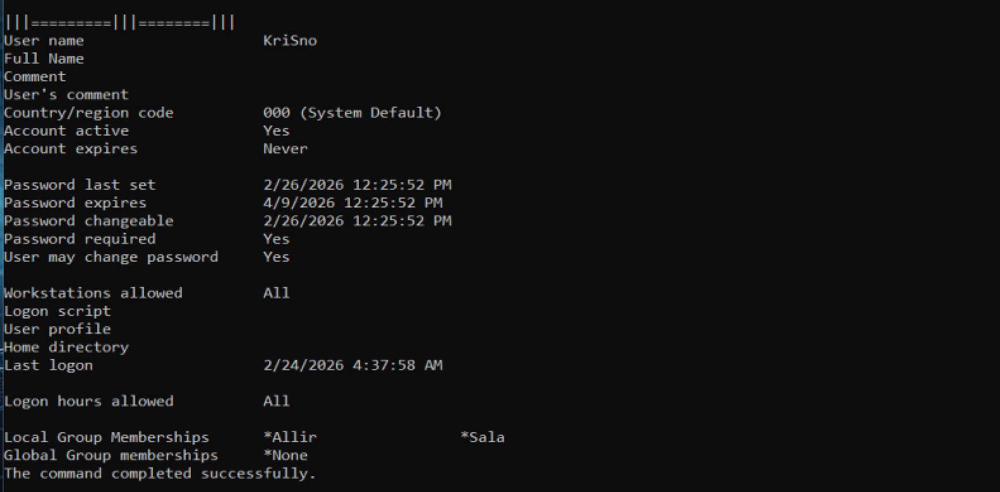
#### This is for the user (OlaLei).

#### This is for the user (PerSte).
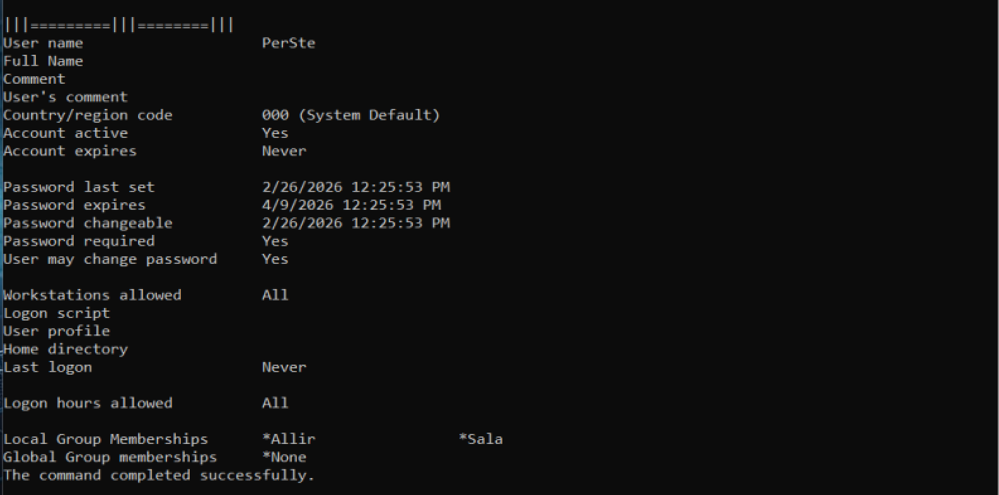
#### This is for the user (VilTra).
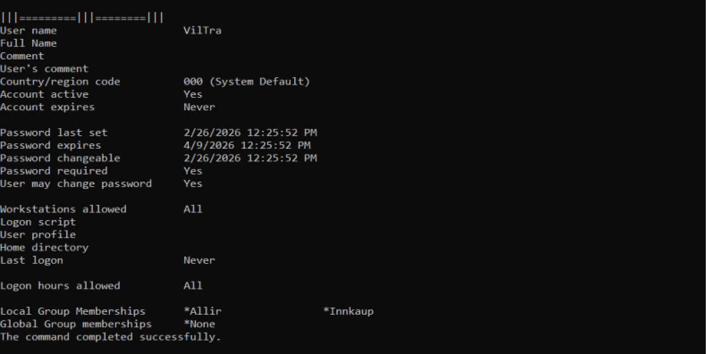
#### This picture shows the password has been set to min-length (8) columns.
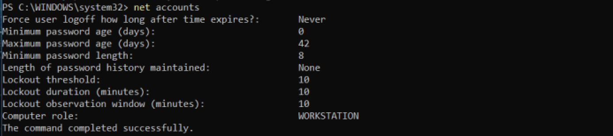
#### This is from the firewall part and shwos that pings are allowed.
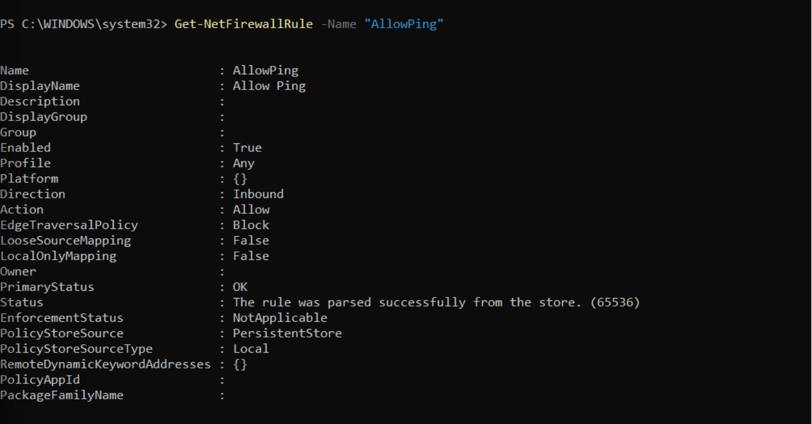
#### This image shows that the inpund connections are blocked by default.
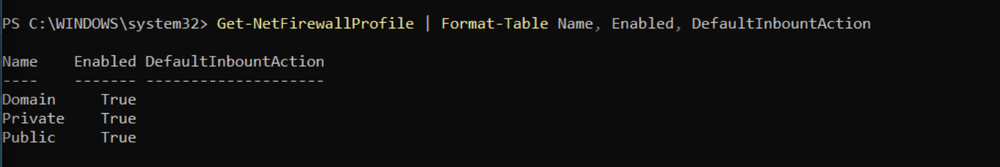
### The next 2 images are for the apps that we were required to download on the VM.
#### This shows that ive downloaded (VScode)-(Python).
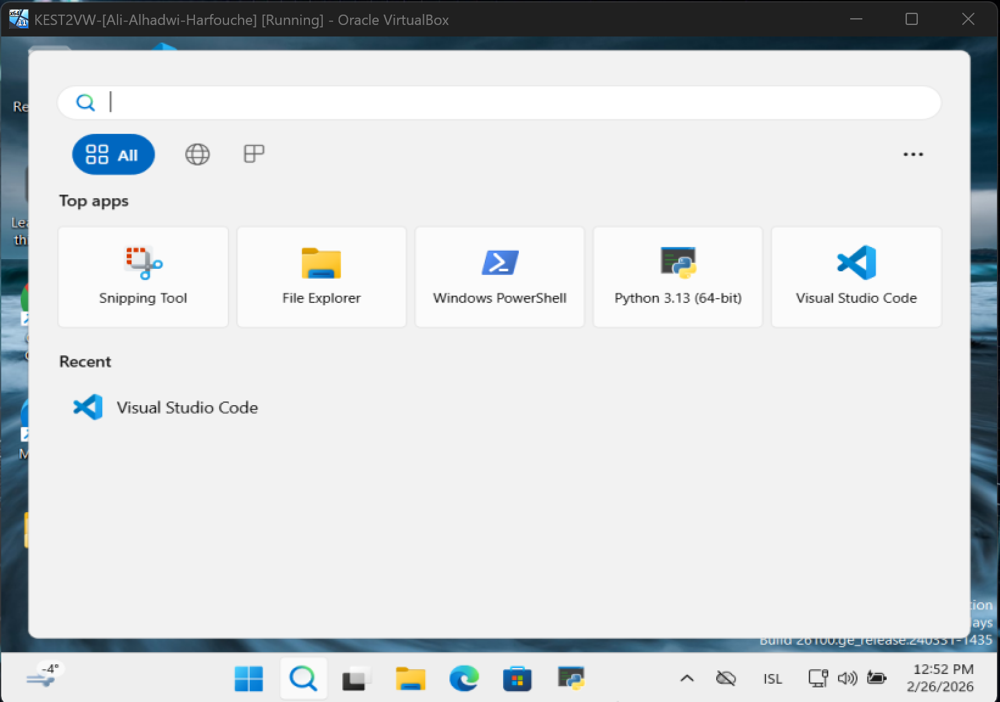
#### And this one shows (Git).
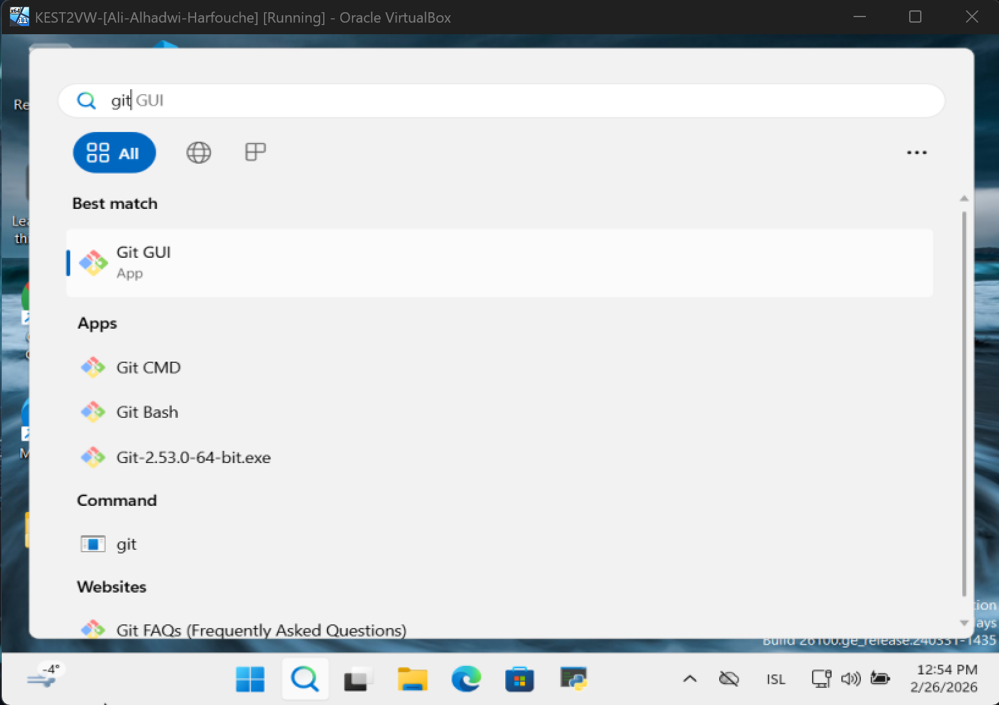

